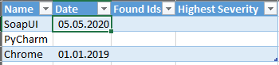
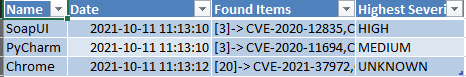

# CVE_Checker

In the current version, CVE_Checker is a Python script, that takes a csv formatted file(.csv or .xlsx) and checks 
for new entries in the CVE-Register from https://nvd.nist.gov/. Therefor it queries the API and write back the results
to a specified .csv or .xlsx file.

## Purpose/Use-case
CVE_Checker should support Admins and Software-Managers to make sure their Software is secure.
The User can create a file with a special format(described in next section), which is the input of
this Program.

## How It works
The script works with .csv and excel(.xlsx) files.
This version only supports one specific format of Input and Output-data:

There must be a table with 4 columns:
1. **Name**: This is the keyword for that the API is queried. I recommend using the name of the Software/Device you want to check for.
2. **Date**: The date when the last check took place. The search will just output CVE'S that are created after this date.
3. **Found Items**: A list of the CVE-Numbers -> The result of the API-Query
4. **Highest Severity**: Has the purpose that the User can classify the results for this Software better.
**Possible values:** UNKNOWN, LOW, MEDIUM, HIGH, CRITICAL

The Name is the only required field! If there is no data received for a search, then the last 2 Fields
remain empty.

ATTENTION: The original file is deleted and a new file is created when writing the results to a file.
Thus all specific setting in an excel file or other contents are lost!

**Examples for input-files can be found in the examples folder!**

### Errors 
In case of an error with the query the old data row from the input is used for the output.
Please have a look at the commandline. There you will see Information on the progress and possible errors if
they occur.

## Usage
Currently, CVE_Checker is a Commandline-tool. The user gives the input-parameters via commandline arguments.

An example:

`python3 cve_checker.py -i sampleInput.csv -n namecolumn-number -d datecolumn-number`

### Commandline Arguments
1. **-i, -input [path]**: path to the input-file (required!)
2. **-o, -output [path]**: path to the output file. If no such path is given, the input file is overwritten
3. **-excel**: flag to tell the program if the input file is an excel file. If not given, a csv file is expected
4. **-dc, -date_col [number]**: number (starting from 0) of the column where the date(of last check) is stored
5. **-nc, -name_col [number]**: number (starting from 0) of the column where the keyword/name for the search is stored

### After Execution

- The Date is updated to the time when the query was made.
- Found Items holds a list of all CVE's found
- Highest Severity contains the max severity of all CVE's

## Future Improvements
- more keywords and advanced search parameters
- more flexible input and output formats! (configs?)
- introduce logging